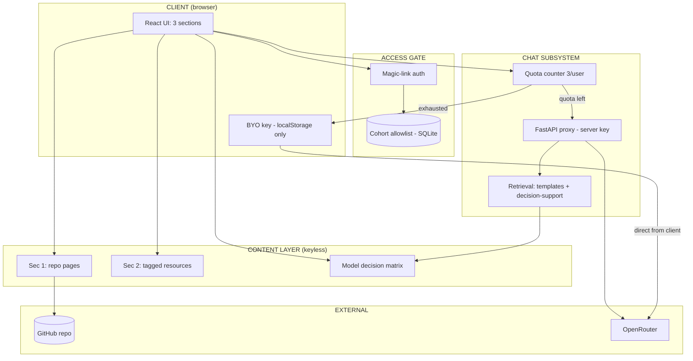

# Companion App Architecture — annotated worked example

Stack: React (Vite) · FastAPI · SQLite · OpenRouter. PoC by design — legibility over robustness. Licensed GPLv3.

## The five zones

## Why each choice (the teaching annotations)

| Choice | Why |
|---|---|
| **Server proxy holds the workshop key** | The one non-negotiable: keys never reach the browser. The box that must never live in the client. |
| **BYO keys in localStorage, calling OpenRouter directly** | Our server never sees participant keys — different trust model, deliberately asymmetric. Server mode = RAG (retrieve then generate); BYO mode = client context-stuffing (whole small corpus in the prompt). Same corpus, two retrieval strategies — compare them. |
| **SQLite, single file** | A PoC serving ~150 users for 3 weeks needs no more. Students can open the DB file and *read* it — inspectability is pedagogy. |
| **Quota = 3 queries, decrement only on valid responses** | Scarcity teaches deliberate querying (worked examples shown pre-chat). The math: 150 × 3 × Flash-class ≈ $0.50 total — the quota is pedagogical, not financial. |
| **Content fetched from GitHub at build time, not runtime** | Low bandwidth, no rate limits, works when GitHub hiccups. Repo stays the single source of truth. |
| **Magic links, no passwords** | Least credential surface for a 3-week app; allowlist = the paid-cohort gate. |
| **Sunset as a designed state** | Teardown checklist written before deploy. Killing software cleanly is an engineering skill. |
